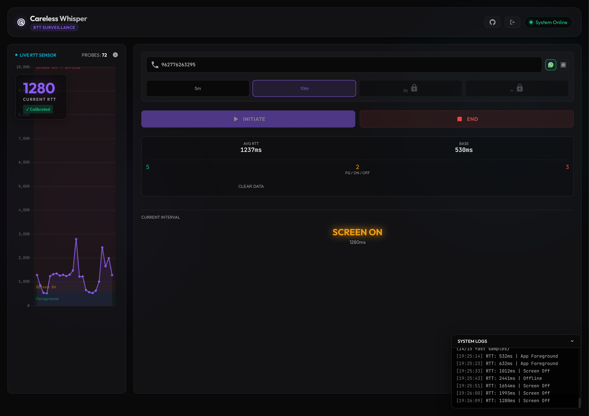

# Careless Whisper - WhatsApp RTT Surveillance Tool

<div align="center">


[](http://34.66.138.153:3000)


**A phone number can reveal whether a device is active, in standby or offline (and more).** 


[Features](#features) • [Installation](#installation)  • [Research](#research-background) • [Test Demo](http://34.66.138.153:3000) • [Warning](#ethical--legal-warning)

</div>

---

---

## ⚠️ DISCLAIMER

**Proof-of-concept for educational and security research purposes only. Demonstrates privacy vulnerabilities in WhatsApp and Signal.**

---


## Table of Contents

- [Overview](#overview)
- [Features](#features)
- [How It Works](#how-it-works)
- [Installation](#installation)
- [Usage Guide](#usage-guide)
- [Research Background](#research-background)
- [Ethical & Legal Warning](#ethical--legal-warning)

---

## Overview

**Careless Whisper** is an advanced surveillance tool that implements the attack methodology described in the research paper *"Careless Whisper: Leveraging Advances in Instant Messaging to Profile Users"*. 

The tool exploits timing side-channels in WhatsApp's message delivery mechanism to infer sensitive information about target devices:

- **App State Detection**: Determine if WhatsApp is in foreground or background
- **Screen Status**: Detect whether the device screen is on or off
- **Device Fingerprinting**: Identify device brand (iPhone vs Android) through RTT pattern analysis
- **Real-time Monitoring**: Track target activity with sub-second precision
- **Visual Analytics**: Interactive charts and comprehensive statistics
- **Pattern Recognition**: Automatic classification based on RTT thresholds

---

## Interface



---

## Features

### Core Capabilities

#### Real-Time RTT Monitoring
- Live dashboard with instant updates
- Sub-second latency measurements
- Automatic probe scheduling with configurable intervals
- Silent probing without user notification

#### Status Classification
Intelligent classification based on calibrated thresholds:
- **Foreground** (< 900ms): App actively in use
- **Screen On** (< 1,600ms): Device awake, app in background  
- **Screen Off** (< 3,800ms): Device locked/sleeping
- **Offline** (> 3,800ms): No connection or airplane mode

---

## How It Works

### Attack Methodology

The tool exploits WhatsApp's delivery receipt mechanism through a sophisticated timing attack:

#### 1. **Silent Probe Generation**
```javascript
// Sends invalid reaction messages that trigger receipts without notifications
socket.emit({
    key: { remoteJid: targetNumber },
    message: { reactionMessage: { key: invalidKey } }
});
```

#### 2. **RTT Measurement**
- Records timestamp when probe is sent
- Waits for delivery receipt from WhatsApp server
- Calculates round-trip time: `RTT = receipt_time - send_time`

#### 3. **Status Inference**
Based on extensive research and calibration:

| RTT Range | Device Status | Reasoning |
|-----------|--------------|-----------|
| < 900ms | App Foreground | Instant push delivery, app handles immediately |
| 900-1,600ms | Screen On | Quick wake-up, app background processing |
| 1,600-3,800ms | Screen Off | Device must wake from sleep, delayed processing |
| > 3,800ms | Offline | No connection, airplane mode, or device off |

*Thresholds are adjusted +300ms for Jordan network baseline latency*

#### 4. **Device Fingerprinting**
Analyzes RTT variance patterns:
- **iPhone**: Lower variance (~50-100ms), consistent timing
- **Android**: Higher variance (~150-300ms), varies by manufacturer
- Statistical analysis determines device brand with confidence scoring

### Technical Implementation

```
User Browser ←[Socket.IO]→ Express Server
                              ↓
                    ┌─────────┴─────────┐
                    │                   │
            WhatsApp Connector    RTT Analyzer
                    │                   │
                    └─────────┬─────────┘
                              ↓
                    Monitoring Controller
                              ↓
                    JSON Export / Results
```

---

## Installation

### Prerequisites

Before installation, ensure you have:

- **Node.js** 16+ ([Download](https://nodejs.org/))
- **npm** (included with Node.js)
- **WhatsApp** account with mobile app access
- **Git** (optional, for cloning)

### Step 1: Download the Project

**Option A: Clone from GitHub**
```bash
git clone https://github.com/Ti-03/Careless-Whisper.git
cd Careless-Whisper
```

**Option B: Download ZIP**
1. Download repository as ZIP file
2. Extract to desired location
3. Open terminal in extracted folder

### Step 2: Install Dependencies

```bash
npm install
```

This installs:
- `@whiskeysockets/baileys` - WhatsApp Web API client
- `express` - Web server framework
- `socket.io` - Real-time bidirectional communication
- `qrcode` - QR code generation for authentication

### Step 3: Verify Installation

```bash
node server.js
```

Expected output:
```
🌐 Web Interface running at: http://localhost:3000

📱 Connecting to WhatsApp...
```

---

## Usage Guide

### Quick Start

#### 1. Start the Server

```bash
node server.js
```

The server will start on `http://localhost:3000`

#### 2. Connect to WhatsApp

1. Open browser and navigate to `http://localhost:3000`
2. Go to the **Setup** tab
3. Ensure **WhatsApp** platform is selected
4. Wait for QR code to appear
5. Open WhatsApp on your phone:
   - Android: Menu → Linked Devices → Link a Device
   - iPhone: Settings → Linked Devices → Link a Device
6. Scan the QR code
7. Wait for "Connected" status

#### 3. Configure Monitoring

In the **Setup** tab:

**Target Phone Number**
- Enter in international format (no + or 00)
- Example: `962791234567` (Jordan)
- Example: `14155551234` (USA)

**Duration**
- Set monitoring duration in minutes
- Recommended: 5-30 minutes for testing
- Maximum: 120 minutes

**Probe Interval**
- Time between probes in seconds
- ⚠️ **CRITICAL**: Use 15-30 seconds minimum
- Values < 5s have **HIGH ACCOUNT BAN RISK**
- Lower = more accurate, higher = safer

#### 4. Start Monitoring

1. Click **Start Monitoring** button
2. Switch to **Monitor** tab to see real-time statistics
3. Switch to **Analytics** tab for RTT charts
4. Check **Logs** tab for detailed activity log

#### 5. View Results

**Monitor Tab**: Live statistics including:
- Total probes sent
- Average RTT
- Status distribution (Foreground/Screen On/Screen Off/Offline)

**Analytics Tab**: 
- Interactive RTT timeline chart
- Device fingerprint information (after 5+ measurements)
- Historical pattern analysis

**Logs Tab**:
- Timestamped event log
- RTT measurements with status
- System messages and errors

#### 6. Export Results

Results are automatically saved to JSON files:
```
rtt_measurements_YYYY-MM-DDTHH-MM-SS.sssZ.json
```

Contains:
```json
{
  "target": "962XXXXXXXXX",
  "timestamp": "2025-12-18T10:30:00.000Z",
  "rtt_ms": 450,
  "status": "APP_FOREGROUND",
  "device_profile": {
    "device_type": "iPhone",
    "confidence": 0.85
  }
}
```

---


### Module Responsibilities

#### **server.js** - Application Core
- Initializes Express HTTP server
- Sets up Socket.IO for real-time communication
- Coordinates between all modules
- Handles client connections and routing

#### **src/connectors/whatsapp.js** - WhatsApp Integration
- Manages authentication and connection lifecycle
- Handles QR code generation
- Sends probe messages
- Processes message receipts and status updates
- Emits events for connection status changes

#### **src/analyzer/rtt.js** - Analysis Engine
- Registers and tracks probes with timestamps
- Calculates RTT from receipt timing
- Classifies device status based on thresholds
- Performs statistical device fingerprinting
- Detects state transitions (screen on/off)
- Generates comprehensive statistics

#### **src/controller/monitoring.js** - Session Management
- Manages monitoring sessions (start/stop)
- Schedules probes at configured intervals
- Auto-stops after duration expires
- Exports results to JSON files
- Provides session status and progress

#### **public/index.html** - User Interface
- Modern React-like single-page application
- Multi-tab navigation (Setup/Monitor/Analytics/Logs)
- Real-time updates via Socket.IO
- Chart.js visualizations
- Platform selection (WhatsApp/Signal)
- Responsive design with light theme

### Data Flow

```
┌─────────────────┐
│  Browser Client │
└────────┬────────┘
         │ Socket.IO (WebSocket)
         ↓
┌─────────────────┐
│   server.js     │ ← Main coordinator
└────────┬────────┘
         │
    ┌────┴────┬─────────────┬──────────────┐
    ↓         ↓             ↓              ↓
┌──────┐  ┌────────┐  ┌─────────┐  ┌──────────┐
│WhatsApp│ │  RTT   │  │Monitor  │  │ Express  │
│Connector│→│Analyzer│←→│Controller│ │  Routes  │
└──────┘  └────────┘  └─────────┘  └──────────┘
    │          │            │
    ↓          ↓            ↓
  Baileys   Statistics    JSON
   API      & Charts      Export
```

---

### Probe Interval Recommendations

| Interval | Risk Level | Use Case |
|----------|-----------|----------|
| 0.5-2s | EXTREME | Never use (instant ban) |
| 3-5s | HIGH | Research only, temporary |
| 10-15s | MEDIUM | Short-term monitoring |
| 20-30s | LOW | Recommended for production |
| 60s+ | SAFE | Long-term surveillance |

---

## Research Background

### Academic Paper

This tool implements research from:

**"Careless Whisper: Leveraging Advances in Instant Messaging to Profile Users"**

The paper demonstrates how instant messaging applications leak user activity information through timing side-channels, even when all privacy settings are maximized.

### Key Findings

1. **Timing Side-Channels**: Message delivery timing reveals app state
2. **No Notification**: Probes are silent and leave no user-visible trace
3. **Privacy Bypass**: Works regardless of "Last Seen" privacy settings
4. **Device Fingerprinting**: RTT patterns uniquely identify device types
5. **Real-time Tracking**: Activity can be monitored continuously

### Implications

- **Privacy Concerns**: Users cannot opt-out of this surveillance
- **Platform Responsibility**: Messaging apps need timing-attack mitigations
- **Security Research**: Demonstrates need for privacy-preserving protocols

---

## Ethical & Legal Warning

### EDUCATIONAL USE ONLY

This tool is provided **strictly for educational and security research purposes**.


<div align="center">

**Use Responsibly. Respect Privacy. Follow the Law.**

[⬆ Back to Top](#careless-whisper---whatsapp-rtt-surveillance-tool)

---

*"The best defense is understanding the attack"*

</div>
